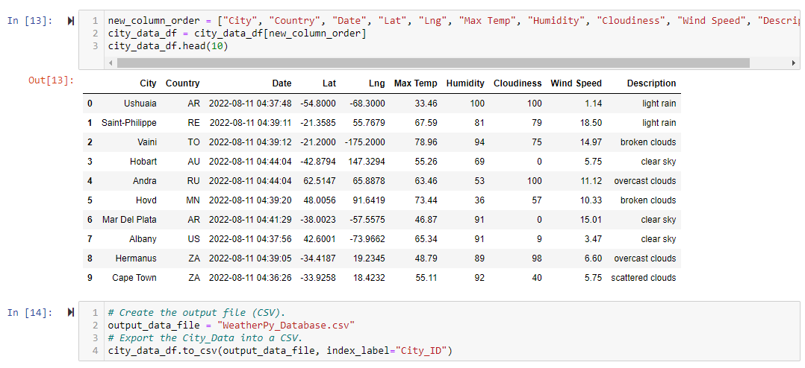
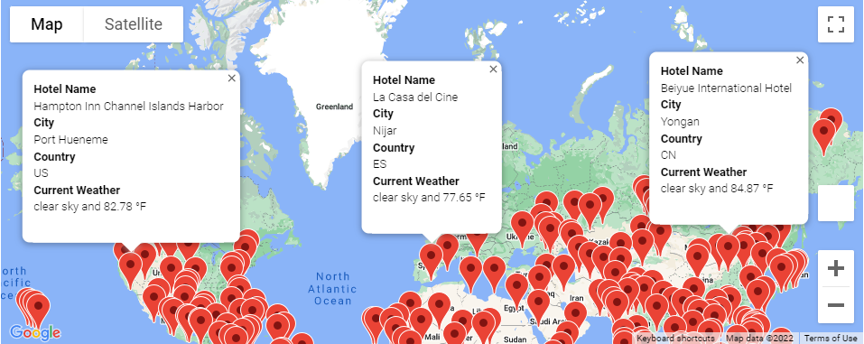
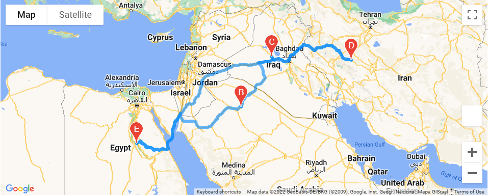
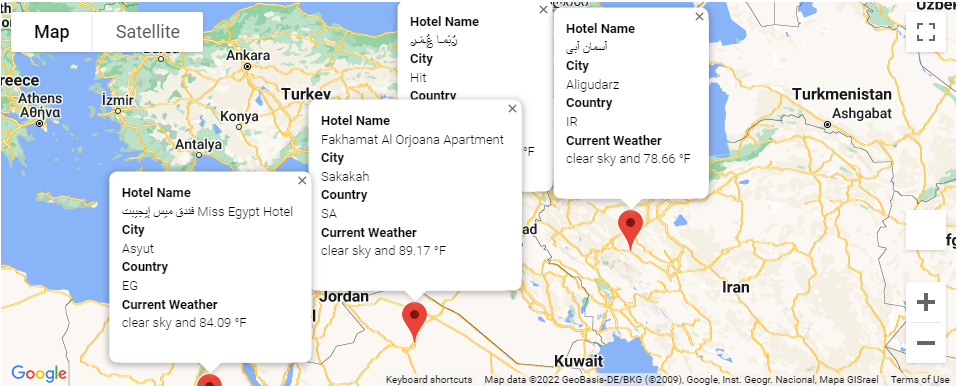

# World_Weather_Analysis

## Overview of the Project

Analyzing global weather data for the PlanMyTrip App using Google API's and creating customized travel itinerary maps based on travelers' ideal weather preferences.

## Deliverables

### (1) Retrieve Weather Data

First, I generated a set of 2,000 random latitudes and longitudes, retrieved the nearest city, and perform an API call with the OpenWeatherMap. In addition to the city weather data I gathered earlier in the module, I utilized my API skills to retrieve the current weather description for each city. Finally, I created a new DataFrame containing the updated weather data.

### (2) Create a Customer Travel Destinations Map

I used input statements to retrieve customer weather preferences, then used those preferences to identify potential travel destinations and nearby hotels. I created a marker layer map to show those destinations with pop-up markers.

### (3) Create a Travel Itinerary Map

I used the Google Directions API to create a travel itinerary that shows the route between four cities chosen from the customer’s possible travel destinations. I then created a marker layer map with a pop-up markers for each city on the itinerary.

## Summary
The updated and improved code will allow the PlanMyTrip App's users to create and customize their own trip itineraries based on their weather preference inputs.  They will be able to identify nearby hotels in their designated cities and create personalized maps with pop up markers and a directions layer to better organize their ideal travel journey.
